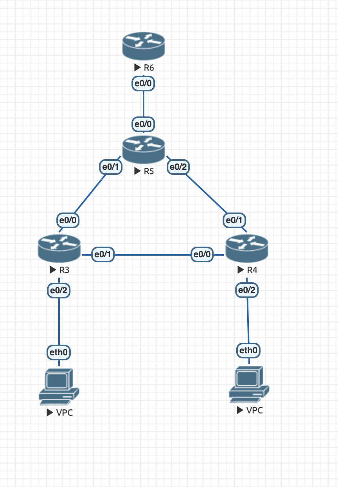

## Топология сети ##




1) VPC-1

```
ip 10.0.10.2 255.255.255.0 10.0.10.1
```

2) VPC-2

```
ip 10.0.20.2 255.255.255.0 10.0.20.1
```

3) Switch-3

```
Switch>enable
Switch#conf t
Switch(config)#vlan 10
Switch(config-vlan)#exit
Switch(config)#vlan 20
Switch(config-vlan)#exit
Switch(config)#interface e0/0
Switch(config-if)#switchport mode access
Switch(config-if)#switchport access vlan 10
Switch(config-if)#exit
Switch(config)#interface e0/1
Switch(config-if)#switchport trunk encapsulation dot1q
Switch(config-if)#switchport trunk allowed vlan 10,20
Switch(config-if)#switchport mode trunk
Switch(config-if)#exit
Switch(config)#interface e0/2
Switch(config-if)#switchport trunk encapsulation dot1q
Switch(config-if)#switchport trunk allowed vlan 10,20
Switch(config-if)#switchport mode trunk
Switch(config-if)#exit
Switch(config)#vtp mode transparent
Switch(config)#exit
Switch#wr

```

4) Switch-4
```
Switch>enable
Switch#conf t
Switch(config)#vlan 10
Switch(config-vlan)#exit
Switch(config)#vlan 20
Switch(config-vlan)#exit
Switch(config)#interface e0/2
Switch(config-if)#switchport mode access
Switch(config-if)#switchport access vlan 20
Switch(config-if)#exit
Switch(config)#interface e0/0
Switch(config-if)#switchport trunk encapsulation dot1q
Switch(config-if)#switchport mode trunk
Switch(config-if)#switchport trunk allowed vlan 10,20
Switch(config-if)#exit
Switch(config)#interface e0/1
Switch(config-if)#switchport trunk encapsulation dot1q
Switch(config-if)#switchport mode trunk
Switch(config-if)#switchport trunk allowed vlan 10,20
Switch(config-if)#exit
Switch(config)#vtp mode transparent
Switch(config)#exit
Switch#wr
```
5) Switch-5

```
Switch>enable
Switch#conf t
Switch(config)#vlan 10
Switch(config-vlan)#exit
Switch(config)#vlan 20
Switch(config-vlan)#exit
Switch(config)#interface e0/1
Switch(config-if)#switchport trunk encapsulation dot1q
Switch(config-if)#switchport mode trunk
Switch(config-if)#switchport trunk allowed vlan 10,20
Switch(config-if)#exit
Switch(config)#interface e0/0
Switch(config-if)#switchport trunk encapsulation dot1q
Switch(config-if)#switchport mode trunk
Switch(config-if)#switchport trunk allowed vlan 10,20
Switch(config-if)#exit
Switch(config)#interface e0/2
Switch(config-if)#switchport trunk encapsulation dot1q
Switch(config-if)#switchport mode trunk
Switch(config-if)#switchport trunk allowed vlan 10,20
Switch(config-if)#exit
Switch(config)#spanning-tree vlan 1 root primary
Switch(config)#spanning-tree vlan 10 root primary
Switch(config)#spanning-tree vlan 20 root primary
Switch(config)#vtp mode transparent
Switch(config)#exit
Switch#wr
```

6) Router
```
Router>enable
Router#conf t
Router(config)#interface e0/0
Router(config-if)#no shutdown
Router(config-if)#exit
Router(config)#interface e0/0
Router(config)#interface e0/0.10
Router(config-subif)#encapsulation dot1Q 10
Router(config-subif)#ip address 10.0.10.1 255.255.255.0
Router(config-subif)#exit
Router(config)#interface e0/0.20
Router(config-subif)#encapsulation dot1Q 20
Router(config-subif)#ip address 10.0.20.1 255.255.255.0
Router(config-subif)#exit
Router(config)#exit
Router#wr
```