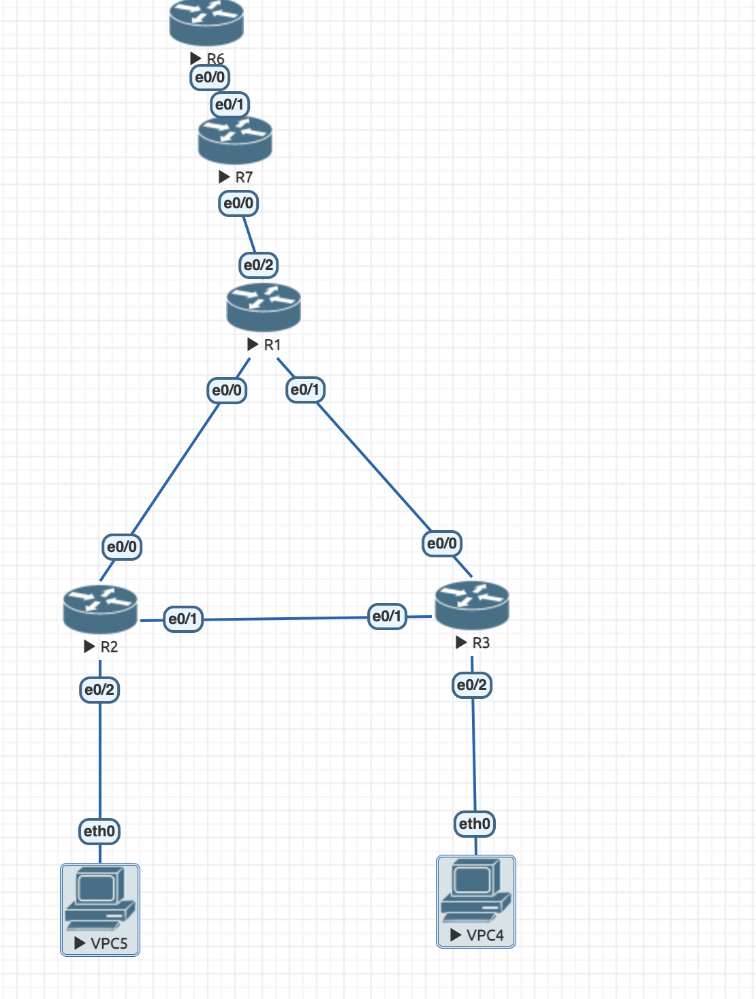

## Топология сети ##




1) VPC-1

```
ip dhcp
```

2) VPC-2

```
ip dhcp
```

3) Switch-3

```
Все аналогично прошлому дз
```

4) Switch-4
Все аналогично прошлому дз
```
5) Switch-5

```
Все аналогично прошлому дз
```

6) Router
```
Router>enable
Router#conf t
Router(config)#ip dhcp excluded-address 10.0.10.0 10.0.10.10
Router(config)#ip dhcp pool Left_Network
Router(dhcp-config)#default-router 10.0.10.1
Router(dhcp-config)#dns-server 10.0.10.2
Router(dhcp-config)#option 150 ip 10.0.10.3
Router(dhcp-config)#network 10.0.10.0 255.255.255.0
Router(dhcp-config)#exit
Router(config)#ip dhcp excluded-address 10.0.20.0 10.0.20.10
Router(config)#ip dhcp pool Right_Network
Router(dhcp-config)#default-router 10.0.0.2
Router(dhcp-config)#default-router 10.0.20.1
Router(dhcp-config)#dns-server 10.0.20.2
Router(dhcp-config)#option 150 ip 10.0.20.3
Router(dhcp-config)#network 10.0.20.0 255.255.255.0
Router(dhcp-config)#exit
Router(config)#exit
Router#conf t
Router(config)#access-list 100 permit ip 10.0.0.0 0.255.255.255 any
Router(config)#ip nat pool NAME_OF_POOL 11.1.1.10 11.1.1.20 netmask 255.255.255.0
Router(config)#interface e0/1
Router(config-if)#no shutdown
Router(config-if)#ip address 11.1.1.1 255.255.255.0
Router(config-if)#exit
Router(config)#interface e0/0
Router(config-if)#ip nat inside
Router(config-if)#exit
Router(config)#interface e0/0.10
Router(config-subif)#ip nat inside
Router(config-subif)#exit
Router(config)#interface e0/0.20
Router(config-subif)#ip nat inside
Router(config-subif)#exit
Router(config)#exit
Router#conf t
Router(config)#ip nat inside source list 100 pool POOL
Router(config)#vtp mode transaprent
Router(config)#exit
Router#wr

```
7) Router
Router>enable
Router#conf t
Router(config)#interface e0/0
Router(config-if)#no shutdown
Router(config-if)#ip address 11.0.10.2 255.255.255.0
Router(config-if)#exit
Router#wr