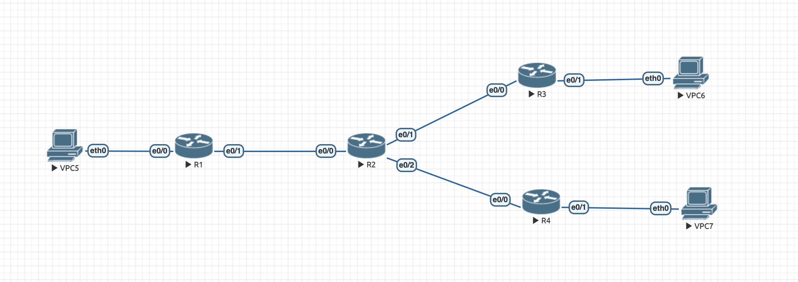

## Топология сети ##



1) VPC-5

```
ip 10.0.10.2 255.255.255.0 10.0.10.1
```

2) VPC-6

```
ip 10.0.20.2 255.255.255.0 10.0.20.1
```

3) R1

```
Router>enable
Router#conf t
Router(config)#interface e0/0
Router(config-if)#no shutdown
Router(config-if)#ip address 10.0.10.1 255.255.255.0
Router(config-if)#exit
Router(config)#interface e0/1
Router(config-if)#ip address 1.1.10.2 255.255.255.0
Router(config-if)#no shutdown
Router(config-if)#exit
Router(config)#interface Tunnel100
Router(config-if)#ip address 172.16.10.1 255.255.255.0
Router(config-if)#ip mtu 1400
Router(config-if)#ip tcp adjust-mss 1360
Router(config-if)# tunnel source 1.1.10.2
Router(config-if)#tunnel destination 1.1.20.2
Router(config-if)#exit
Router(config)#ip route 0.0.0.0 0.0.0.0 1.1.10.1
Router(config)#ip route 10.0.20.2 255.255.255.255 172.16.10.2

Router(config)#interface Tunnel200
Router(config-if)#ip address 172.16.11.1 255.255.255.0
Router(config-if)#ip mtu 1400
Router(config-if)#ip tcp adjust-mss 1360
Router(config-if)#tunnel source 1.1.10.2
Router(config-if)#tunnel destination 1.1.30.2
Router(config-if)#exit

Router(config)#crypto isakmp policy 1
Router(config-isakmp)#encr 3des
Router(config-isakmp)#hash md5
Router(config-isakmp)#authentication pre-share
Router(config-isakmp)#group 2
Router(config-isakmp)#lifetime 86400
Router(config-isakmp)#exit
Router(config)#crypto isakmp key merionet address 1.1.30.2
Router(config)#crypto ipsec transform-set TS esp-3des esp-md5-hmac
Router(cfg-crypto-trans)#mode transport
Router(cfg-crypto-trans)#exit
Router(config)#crypto ipsec profile protect-gre
Router(ipsec-profile)#set security-association lifetime seconds 86400
Router(ipsec-profile)#set transform-set TS
Router(ipsec-profile)#exit
Router(config)#interface Tunnel200
Router(config-if)# tunnel protection ipsec profile protect-gre
Router(config-if)#exit
```
4) R2

```
Router>enable
Router#conf t
Router(config)#interface e0/0
Router(config-if)#no shutdown
Router(config-if)#ip address 1.1.10.1 255.255.255.0
Router(config-if)#exit
Router(config)#interface e0/1
Router(config-if)#ip address 1.1.20.1 255.255.255.0
Router(config-if)#no shutdown
Router(config-if)#exit
```

5) R3

```
Router>enable
Router#conf t
Router(config)#interface e0/0
Router(config-if)#no shutdown
Router(config-if)#ip address 1.1.20.2 255.255.255.0
Router(config-if)#interface e0/1
Router(config-if)#no shutdown
Router(config-if)#ip address 10.0.20.1 255.255.255.0
Router(config)#exit
Router(config)#interface Tunnel100
Router(config-if)#ip address 172.16.10.2 255.255.255.0
Router(config-if)# ip mtu 1400
Router(config-if)# ip tcp adjust-mss 1360
Router(config-if)# tunnel source 1.1.20.2
Router(config-if)#tunnel destination 1.1.10.2
Router(config-if)#exit
Router(config)#ip route 0.0.0.0 0.0.0.0 1.1.20.1
Router(config)#ip route 10.0.10.2 255.255.255.255 172.16.10.1
Router(config)#exit
```

6) R4
```
Router>enable
Router#conf t
Router(config)#interface e0/0
Router(config-if)#no shutdown
Router(config-if)#ip address 1.1.30.2 255.255.255.0
Router(config-if)#exit
Router(config)#interface e0/1
Router(config-if)#no shutdown
Router(config-if)#ip address 10.0.30.1 255.255.255.0
Router(config-if)#exit
Router(config)#interface Tunnel200
Router(config-if)#ip address 172.16.11.2 255.255.255.0
Router(config-if)#ip mtu 1400
Router(config-if)#ip tcp adjust-mss 1360
Router(config-if)#tunnel source 1.1.30.2
Router(config-if)#tunnel destination 1.1.10.2
Router(config-if)#exit
Router(config)#ip route 0.0.0.0 0.0.0.0 1.1.30.1
Router(config)#exit
Router(config)#ip route 10.0.10.2 255.255.255.255 172.16.11.1

Router(config)#crypto isakmp policy 1
Router(config-isakmp)#encr 3des
Router(config-isakmp)#hash md5
Router(config-isakmp)#authentication pre-share
Router(config-isakmp)#group 2
Router(config-isakmp)#lifetime 86400
Router(config-isakmp)#exit
Router(config)#crypto isakmp key merionet address 1.1.10.2
Router(config)#crypto ipsec transform-set TS esp-3des esp-md5-hmac
Router(cfg-crypto-trans)#mode transport
Router(cfg-crypto-trans)#exit
Router(config)#crypto ipsec profile protect-gre
Router(ipsec-profile)#set security-association lifetime seconds 86400
Router(ipsec-profile)#set transform-set TS
Router(ipsec-profile)#exit
Router(config)#interface Tunnel 200
Router(config-if)#tunnel protection ipsec profile protect-gre
Router(config-if)#exit
Router(config)#exit
```
7) VPC-7

```
ip 10.0.20.2 255.255.255.0 10.0.20.1
```